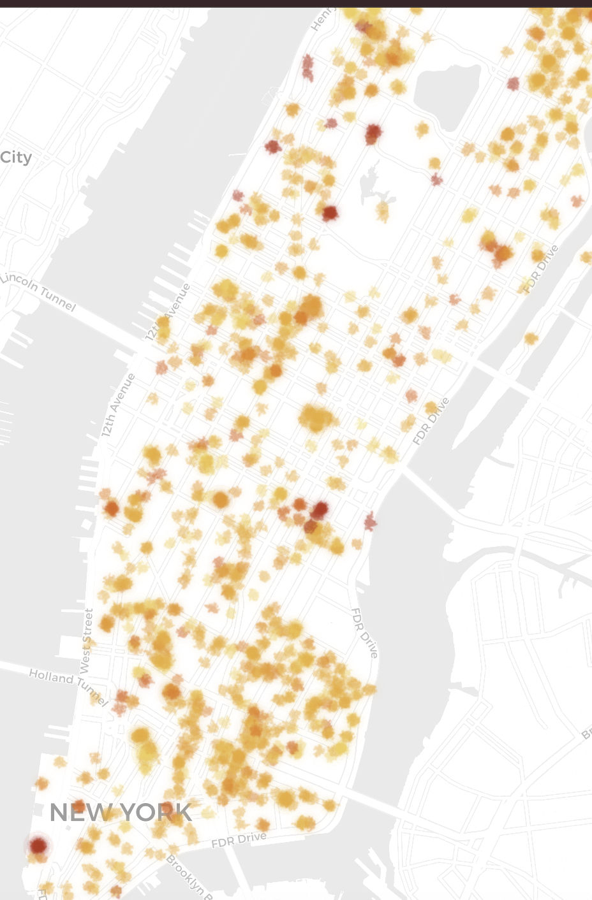

# Silence in Manhattan

*or where to read in NYC ? *

An noise map of Manhattan. 
You can contribuate through a cool dataset or directly on the website: silenceinmanhattan.com




## What it is

Silence in NYC turns urban sound into place. 

Drop a pin, upload or record a short clip, and the server scores **loudness** and **harshness** (mid/high street energy, horns, brakes, sirens, chatter etc..). 
That score becomes a watercolor blot on the map.

Underneath, recent **311 noise complaints** from NYC Open Data.

Intensity runs quiet → street → alert:

- **silence / quiet** — soft ambient wash  
- **lively / noisy** — everyday street energy  
- **harsh** — sharp, high-stress sound  

Spots persist in a local SQLite fresco (`fresque.db`) so the shared map can grow over time.

## Run locally

```bash
python -m venv .venv
source .venv/bin/activate
pip install -r requirements.txt
python server.py
```
